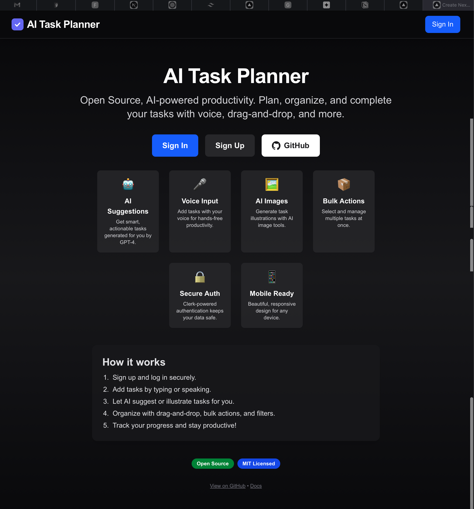

# AI Task Planner

  [](https://github.com/gaddamanand/Ai-Task-Manager-1)



A next-gen, open source productivity app powered by AI, voice, and beautiful UI. Plan, organize, and complete your tasks—smarter and faster.


## Features

- **Clerk authentication:** Secure sign up, sign in, and user management
- **Task CRUD:** Create, edit, delete, search, and filter tasks
- **AI-powered suggestions:** Get actionable task ideas from GPT-4
- **Voice input:** Add tasks hands-free (ElevenLabs)
- **AI image generation:** Visualize tasks (Fal)
- **Drag-and-drop & bulk actions:** Organize and manage tasks efficiently
- **Mobile-first, accessible UI:** Built with Tailwind CSS, Framer Motion
- **Open source & MIT licensed**


## Screenshots


## Tech Stack

- **Next.js 15.3** (App Router, Server Components, Suspense)
- **React 19**
- **Neon** (Postgres)
- **Upstash** (Redis)
- **Clerk** (Auth)
- **ElevenLabs** (Voice)
- **Fal** (Images)
- **Vercel AI SDK** (GPT-4.1)
- **Tailwind CSS, Framer Motion**


## Getting Started

1. **Clone the repo**

   ```bash
   git clone https://github.com/gaddamanand/Ai-Task-Manager-1.git
   cd Ai-Task-Manager-1
   ```

2. **Install dependencies**

   ```bash
   npm install
   ```

3. **Set up environment variables**

   - Copy `.env.example` to `.env.local` and fill in your Neon, Clerk, Upstash, ElevenLabs, Fal, and OpenAI/Vercel AI keys.


4. **Run database migrations**

   - See `prisma/schema.prisma` or `schema.sql` for the latest schema.


5. **Start the dev server**

   ```bash
   npm run dev
   ```


## Documentation

- [Landing Page](https://ai-task-manager-1.vercel.app)
- [Docs](./docs/)
- [API Reference](./docs/api.md)
- [Contributing Guide](./docs/contributing.md)


## Contributing

Contributions are welcome! Please open issues or pull requests for features, bug fixes, or improvements. See [CONTRIBUTING.md](./docs/contributing.md) for details.


## License

MIT — see [LICENSE](./LICENSE)


## Acknowledgments

- [Next.js](https://nextjs.org/), [Clerk](https://clerk.dev/), [Neon](https://neon.tech/), [Upstash](https://upstash.com/), [ElevenLabs](https://elevenlabs.io/), [Fal](https://fal.ai/), [OpenAI](https://openai.com/), [Vercel AI SDK](https://vercel.com/ai), [Tailwind CSS](https://tailwindcss.com/), [Framer Motion](https://www.framer.com/motion/)

> Built with ❤️ by the open source community.
